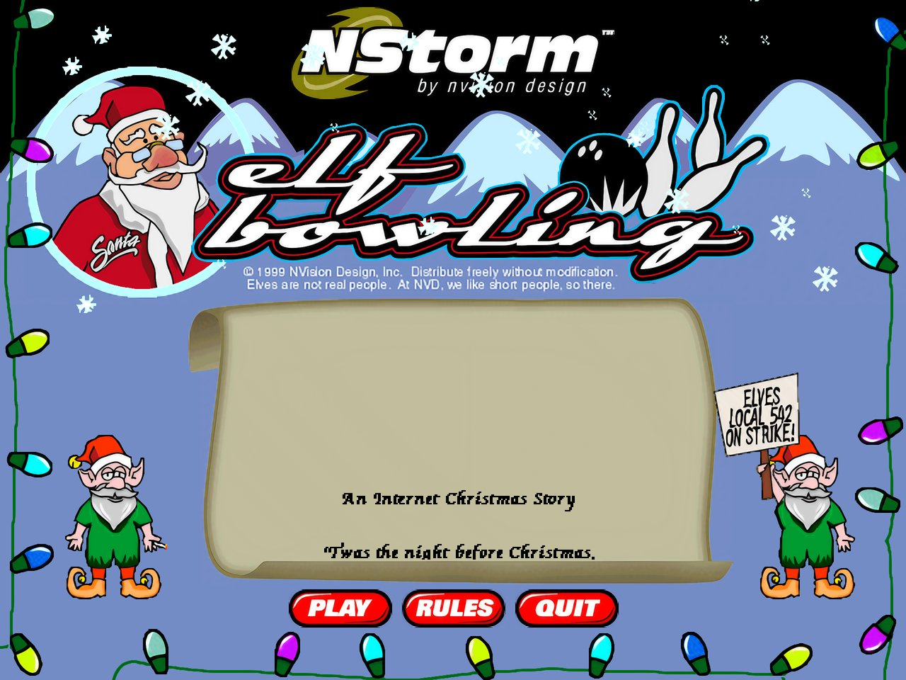
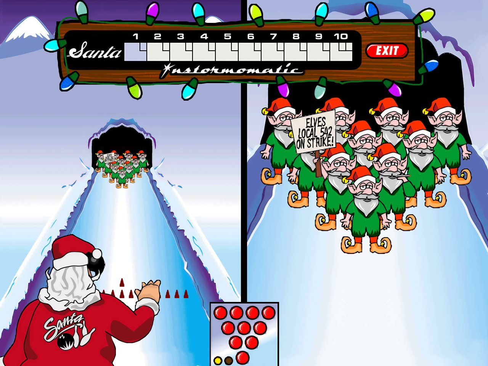
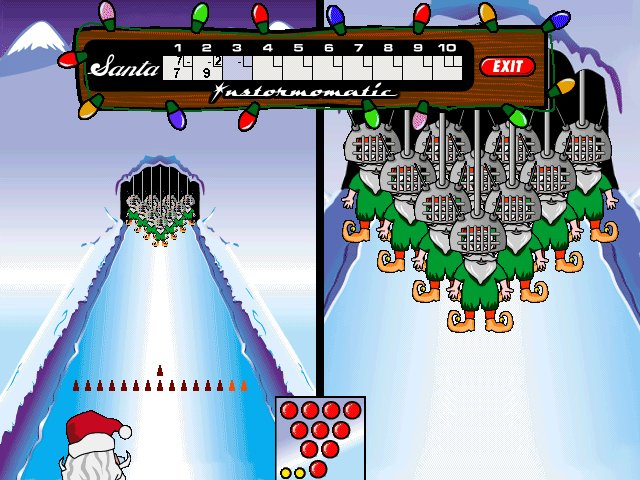
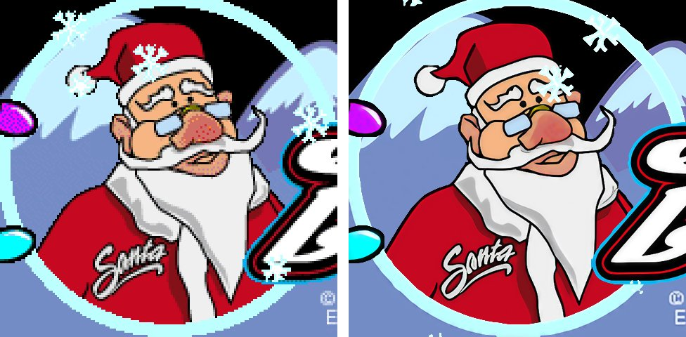
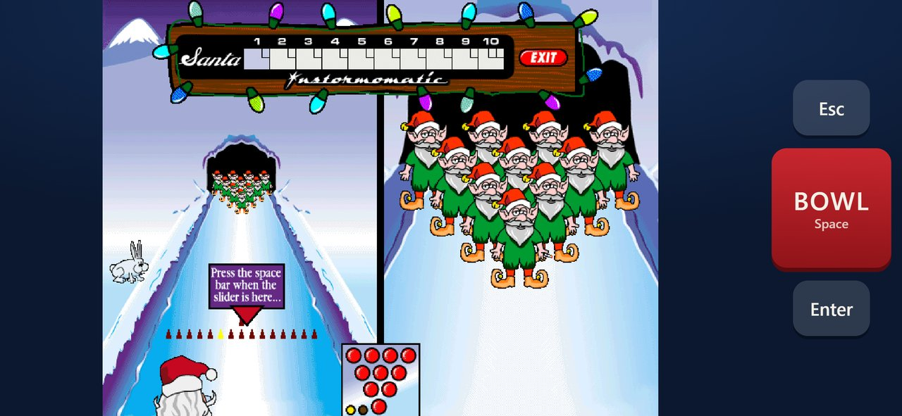

# elfbowling-recomp

A byte-matched decompilation of *Elf Bowling* (NStorm / NVision Design, 1999, Windows), plus native ports built from that same source: macOS, Windows, Linux, Android, iOS and the web, with optional AI-upscaled 3x art.

**All you need is your own copy of the original game.** This repository contains no game code bytes, art, sound or data from the original. Every build reads them at run time from your `Elf Bowling.exe`, and checks it first:

```
SHA-256 dceb5b89544b20744091f55c8ec49d2baaf59bf530ce50a4c2a14d12b069de0c   (1,130,496 bytes, the 1999 release)
```

Elf Bowling was distributed as freeware ("Distribute freely without modification"), so any unmodified copy with this checksum works. The prebuilt packages ask for the file on first launch.



| Santa bowls, 3x HD | Scoring, with the elves in fencing masks |
|---|---|
|  |  |

**Original pixels (left) and the 3x Real-ESRGAN art (right).** The upscaled art is generated on your machine from your own copy of the game.



**The web build on an iPhone held sideways,** with the touch BOWL button.



*Screenshots are of the original 1999 freeware game running on this port.*

## Quick start

| Platform | How |
|---|---|
| Windows / Linux / Android | Download from Releases, run it, and pick your `Elf Bowling.exe` when asked. |
| macOS (build) | `brew install sdl2 sdl2_ttf`, then `make native`, then `ELFBOWL_EXE="/path/to/Elf Bowling.exe" build/elfbowl` |
| Hi-res art (desktop) | `make hires`. It generates 3x art from *your* exe with Real-ESRGAN, and nothing upscaled is distributed. F9 toggles it; F11 is fullscreen. |
| iOS | `port/pkg/build_ipa.sh <your Apple team ID>`. The IPA is signed with your own account, so none is published. |
| Web | See `port/web/README.md` (Emscripten). |

Verifying the byte match (`make verify`) is optional and only needed for decompilation work. It requires your own copy of Borland C++Builder 3 under Wine; see docs/MATCHING.md.

## Target binary

| | |
|---|---|
| File | `orig/1999/Elf Bowling.exe` (not included; supply your own) |
| SHA-256 | `dceb5b89544b20744091f55c8ec49d2baaf59bf530ce50a4c2a14d12b069de0c` |
| PE timestamp | 1999-11-12 21:43 UTC (original release) |
| Size | 1,130,496 bytes; `.text` 0x53800, `.rsrc` 0xAD400 (embedded BMP and WAV) |

A later 2005 collection build (SHA-256 `7b00f57c…98c6`) differs, and it is not supported.

## Toolchain (confirmed)

- The game was built with **Borland C++Builder 3**: `bcc32` 5.3 and `ilink32` (Turbo Incremental Link 3.0), linked against VCL 3.5.
  - The strings contain the `Borland C++ - Copyright 1998` banner.
  - None of the classes added in Delphi 4 appear (`TAnchors`, `TSizeConstraints`, `TBasicAction`).
  - A test program built with BCB3 and `c0w32.obj` produces the game's entry-point code byte for byte, except for relocated addresses.
- The compiler binaries, headers and libraries come from your own C++Builder 3 install. They are fetched into `toolchain/bcb3/`, which is gitignored.
- The compiler runs under Wine 11.18 (Gcenx macOS build, `toolchain/Wine Devel.app`) on Apple Silicon through Rosetta.

## Matching scope

- The VCL, the C++ runtime, and zlib `inflate 1.0` are library code. They are exempt from matching.
- The game logic is the `TForm1` methods plus helper routines. These are the functions that must match.

## Status

- **Matching: 650 / 650 game functions, 128,744 / 128,744 bytes (100%).**
  - Every function in `src_match/` compiles with `bcc32 -Od -k` to bytes identical to the original, ignoring only fixup bytes.
  - Every one of the 2,282 references to another game function also resolves to the original target (`make xref`).
- Not counted in that total, because they are not produced by compiling game source:
  - the VCL/RTL library code, identified in `build/libmap.tsv`;
  - linker-generated unit counters (`#pragma package(smart_init)`);
  - data that sits in the code section.
- `make verify` runs the full correctness gate.

## Native port (macOS arm64, SDL2)

```sh
make native                                   # clang build of src_match/ + port/ into build/elfbowl
ELFBOWL_EXE="orig/1999/Elf Bowling.exe" build/elfbowl
```

- `make hires` (optional) builds 3x AI-upscaled art from your exe; the game then draws at 3x and fits any window size (F9: classic 1x, Alt+Enter/F11: full screen). See docs/HIRES.md.
- You supply your own `Elf Bowling.exe`. All art, sound, the form layout and the initial `.data` values are read from it at build time or run time, and nothing copyrighted is in the repo.
- The same source tree still byte-matches under bcc32 (`make verify`).
- Checked by headless scripted runs (`PORT_INPUT`, `PORT_DUMP_FRAMES`; see docs/SHIM.md):
  - the splash, the title menu, and the bowling lane;
  - Santa's throw, the pins knocking down, and the Instormomatic scoreboard scoring frames;
  - the sound mixer producing output.

## Layout

| Path | Contents |
|---|---|
| `src_match/` | matched C++ source, one file per address range |
| `tools/` | PE/OMF readers, library matcher, function map, matching harness, disassembler, asset unpacker |
| `notes/` | struct layouts, codegen quirks, data-in-code lists and function-end fixes for each range |
| `docs/MATCHING.md` | how to match a function |
| `docs/PORT.md` | native port plan |
| `port/` | Win32 shim and VCL subset on SDL2, native glue, game-data generator |
| `include/elf/` | canonical headers shared by the bcc32 and clang builds |
